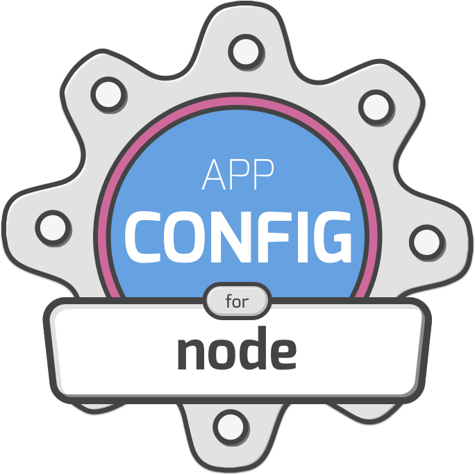

<div align="center">
  
</div>
<br />

# App Config


Opionated and simple configuration loader for node. Comes with strong typing,
schema validation, many supported file formats, secrets, environment variables,
and more.

Why yet-another-config-package? We want strong typing and strict validation of our
configurations, for confidence in development and production. We also want the
flexibility of using different file formats, using environment variables, and
keeping secrets safe. It should be adundantly easy and straightforward to change
configuration with confidence.

**What is it not useful for**: dynamic configuration (functions, behavior), system
global configuration, multi-tenant production systems, in-browser config loading.

### Alternatives
- [rc](https://www.npmjs.com/package/rc)
- [nconf](https://www.npmjs.com/package/nconf)
- [config](https://www.npmjs.com/package/config)
- [node-convict](https://www.npmjs.com/package/convict)

### Core Functionality
- Loads your configuration from environment variable or a file (YAML, TOML, JSON, JSON5)
- Validates your configuration using JSON Schema
  - Includes `$ref` relative file loading for deduplicating schema types
- Generates strong types from your schema (using [quicktype](https://quicktype.io/))
- Includes a CLI tool for injecting configuration as a environment variables
- Global configuration extension, allowing CI specific configuration without overriding config
- Explicit secret config items, disallowed in non-secret configuration

# Getting Started
Simple setup is as follows:

Add the module to your project, using your preferred NPM client.

```
yarn add @servall/app-config

npx app-config init
```

The CLI init command simply creates `.app-config.toml` and `.app-config.schema.yml`.
You can then run `npx app-config variables` at any time to see your population configuration.

### Files and Formats
This module supports YAML, TOML, JSON, and JSON5 out of the box, for any of the files. Your
schema can be YAML, and config be TOML (like the CLI defaults to), or any other way around.

- Configuration files are `.app-config.{ext}`, or `app-config.{ext}`
- Secret configuration items 
- Schema files are `.app-config.schema.{ext}` or `app-config.schema.{ext}`
- Meta files are `.app-config.meta.{ext}` or `app-config.meta.{ext}`
- Meta properties are specified in the root of any file (except meta files) under the `app-config` key
- The `APP_CONFIG` environment variable always takes precendent over files, and can be in any supported format
- The `APP_CONFIG_CI` or `APP_CONFIG_EXTEND` environment variable is parsed and deeply merged with your main configuration, if loading from a file

### CLI
This module comes with a CLI tool for common usage. Running `npx app-config --help`
will give you a list of commands and options.

Common options are:

```
app-config -- {cmd-that-consumes-env-variables}

# for example:
app-config -- docker-compose up -d

# spits out all config to stdout
app-config vars

# spits out all config as a different format
app-config create --format json

# runs code-generation from your schema types
app-config generate
```

Of course, you can and should use `app-config` in your `package.json` scripts.
Note that running commands this way (`--`) also get a `APP_CONFIG` variable in TOML.

### Schemas
This module uses JSON Schema to define constraints on your configuration. As shown above,
the schema is loaded from the `.app-config.schema.{ext}` file. This cannot be specified
by an environment variable, so be certain that it is included in your production environment.

Schemas have support for loading `$ref` properties, to reduce duplication of properties.
That means that if you define a type as `$ref: '../another-file.yml#/definitions/CommonItem'`
that resolution will be completed automatically.

### Secrets
Secrets are defined in your schema.

```yml
super-secret-property:
  type: string
  format: uri
  secret: true
```

Inserting that non-standard key will automatically prevent you from putting that property
in your main `.app-config.{ext}` file, requiring you to put it in `.app-config.secrets.{ext}`.
You should gitignore the secrets file to prevent ever accidentally adding secrets to VCS.

### Code Generation (typescript & others)
This module supports automatic type generation thanks to [quicktype](https://quicktype.io/).
You write the schema, and a typed representation can be generated for you so that your
code is correct.

In your meta file, you can define:

```yml
generate:
  - { type: 'ts', file: 'src/config.d.ts' }
```

You can also do so in a top-level property of your config or schema file.

After this, you can simply run `app-config gen`. This will write the file(s) you specified in
meta configuration. It's recommended to add a call to this in your `dev` script, so that your
code is always in sync with your schema.

Right now, we only officially support typescript, but quicktype is extensible to other languages.
You might have luck simply generating a different file type.

More options are available for generation:

- `type: string` changes the file type, which is inferred by the filename
- `name: string` changes the default config interface's name
- `augmentModule: boolean` turns on or off the automatic module augmentation of app-config's default export
- `leadingComments: string[]` changes the top-of-file comment block that's generated
- `rendererOptions: { [key: string]: string }` adds any quicktype supported renderer option (like `just-types`)


### Extends
This module supports a special 'extending' syntax for deduplicating configuration.

In your main config:

```toml
[app-config]
extends = ["other-file.yml"]
```

This will do a deep merge of `other-file.yml` into your main configuration.

### Node API
This module exports a basic stable node API to do what you would expect.

```typescript
// this is an already validated config object
export default config;

export {
  // loads app config from the filesystem
  loadConfig(cwd?),
  loadConfigSync(cwd?),
  // loads app config schema from the filesystem
  loadSchema(cwd?),
  loadSchemaSync(cwd?),
  // validates the config against a schema
  validate(LoadedConfig & { schema }, cwd?),
  // loads app config and validates the schema
  loadValidated(cwd?),
  loadValidatedSync(cwd?),
  // creates generated files defined in the schema
  generateTypeFiles(cwd?),
} from './schema';
```

Alternatively, if you don't want the config to be loaded on import, you'll need to:

```typescript
import { loadValidated } from '@servall/app-config/dist/exports';

loadValidated(cwd?).then(...);
```

### Roadmap
- [ ] Webpack loader
- [ ] Child `extends` properties
- [ ] Non-js language support
