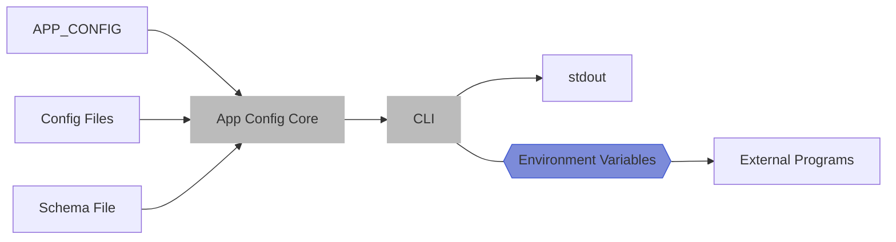

### Command Line Usage

App Config has a pretty comprehensive CLI. The goal is to be useable by non-JavaScript
projects, where possible. As outlined in the introduction, the CLI has two primary use
cases - being a _producer_ or _consumer_ of app-config.

1. It can act as a "producer" of configuration to apps that are agnostic to `app-config`.
2. It can act as a "consumer" of configuration inside of an app, with direct knowledge of `app-config`.



## Nested Commands

App Config will run child commands for you, with extra environment variables injected.

```sh
npx app-config -- env
```

This is the canonical example, as it's simple to explain. `env` is a built-in POSIX command.
Running the above command is asking app-config to run `env` with no arguments, but with
some extra environment variables injected while running.

The output will include `APP_CONFIG` and many other `APP_CONFIG_*` variables. Check out
`app-config vars` to see them all on their own.

```sh
npx app-config -- docker-compose up -d
```

This is a more realistic example. You might have a `docker-compose.yml` file that uses some
environment variables (eg. `APP_CONFIG_DATABASE_PORT` to forward). This injects docker-compose
with variables that it can use.

In general, the pattern of adding NPM scripts like this is common:

```json
  "scripts": {
    ...
    "docker-compose": "app-config -- docker-compose",
    ...
  }
```

This enables a shorter version of the above, `yarn docker-compose up -d`.

## Viewing and Formatting Values

```sh
npx app-config create --format json
```

The create subcommand will generate a config object from the current values.
Note that this command (and most others) **does not include secrets** unless
you add a `-s` flag.

This command also accepts a `--select='#/server'` option, using JSON Pointer syntax
to select a specific nested value inside of the config.

```sh
npx app-config vars
```

The variables subcommand prints out all variables that will be injected when running
[nested commands](#nested-commands).

```sh
npx app-config create-schema
```

The create-schema subcommand provides a way to output the loaded schema, with all
of its `$ref` file references resolved. This can be useful for deployments, so
that you don't need to bundle multiple schema files in production.

## Code Generation

```sh
npx app-config generate
```

The generate command reads the meta file, and does all [code / types generation](./codegen.md).

## Encryption Commands

```sh
npx app-config secret init
```

Initializes your encryption keychain.

```sh
npx app-config secret init-repo
```

Creates initial symmetric key and initializes team members for a repository.

```sh
npx app-config secret init-key
```

Creates a new symmetric key for encrypting new secrets.

```sh
npx app-config secret key
npx app-config secret export <path>
```

View or export your public key to a file.

```sh
npx app-config secret ci
```

Creates an encryption key that can be used without a passphrase.

```sh
npx app-config secret trust <keyPath>
```

Adds a team member who can encrypt and decrypt values.

```sh
npx app-config secret untrust <email>
```

Revokes encryption access (in future) for a trusted team member.

```sh
npx app-config secret encrypt
```

Encrypts a secret value.

```sh
npx app-config secret decrypt
```

Decrypts a secret value.

```sh
npx app-config secret reset
```

Removes your encryption keychain.
